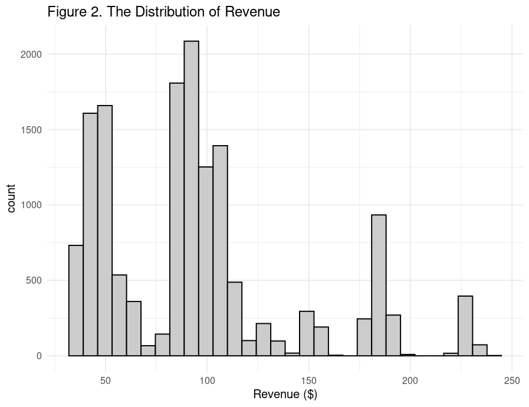

# Evaluating Sales Approaches for the New Product Line

## Executive Summary
This report analyzes revenue performance for the new product line across three sales methods—Email, Call, and a Combined Email+Call strategy. It uses data from the latest six-week project period to inform these comparisons. The report is divided into four sections:

1. Data Validation: Ensures completeness and accuracy of the underlying dataset.

2. Exploratory Analysis: Identifies the distribution of revenue and comparative performance of each sales method.

3. Metric Recommendation: Proposes a simple KPI for ongoing monitoring.

4. Recommendations and Conclusion: Offers actionable insights to optimize sales resource allocation.

By following this framework, the analysis will equip leadership with clear, data‑driven guidance on which sales methods to prioritize moving forward.

## Data Validation
### Overview of Potenital Issues
- Missing Values
	- Checked all variables for missing values: only the revenue variable contains them (1 074 of 15 000 records, 7.16%).

- Out‑of‑Range Values
	- The years_as_customer variable has a maximum of 63, yet the company is only 41 years old—indicating at least one typo in entries.
 
	
### Detailed Variable Checks
In this step, I examine specific variables in greater detail—those whose potential issues may not be evident from the overall summary.

1. years_as_customer
	- Identified two customers with impossible loyalty spans (47 and 63 years).
	- Next step: flag and verify these records, then either correct or remove.

2. sales_method
	- Found inconsistent labeling: e.g., both “Email” and “email”, “Email+Call” and “email+call”.
	- Next step: standardize to the following categories: “Email”, “Call”, “Email+Call”. Also convert to a factor data type for the analysis.

3. state
	- All values conform to the expected list of U.S. states. No issues detected.

4. customer_id
	- All values are unique; no duplicate IDs present. 

### Cleaning Steps

To address the three identified issues—customer loyalty typos, inconsistent sales methods labels, and revenue missingness—I apply targeted cleaning steps that preserve as much data as possible while ensuring accuracy.

- years_as_customer typos
	- Issue: Two entries (47 and 63 years) exceed the company’s 41‑year existence.
	- Action: I convert these values to NA rather than dropping the entire rows—since all other variables for these two rows are complete—to avoid unnecessary data loss. I store the cleaned values in 'years_customer_clean' and keep the original 'years_as_customer' as is.

- sales_method inconsistencies
	- Issue: Mixed casing and formatting across entries.
	- Action: I create a new factor variable, 'sales_method_clean', because its clearly defined categories (Email, Call, Email+Call) suit a factor type and simplify the analysis. I map all case/format variants into these three levels and preserve the original 'sales_method' column for traceability.

- revenue missing values
	- Issue: 1074 records (7.16%) are NA, with missingness uneven by channel (3.6% Call, 7.2% Email, 13.5% Email+Call).
	- Action: I keep the raw values under the 'revenue_raw' label, but impute the median within each sales_method_clean group into the working revenue column. I choose median imputation because this is a quick and robust fix that preserves relative scale, minimizes outlier bias, and avoids unnecessary data loss.

## Exploratory analysis

In this section, I combine visualizations and summary statistics to answer the key questions about sales methods and revenue.

###  Deals per Sales Method
Figure 1 shows the count of obsearvations, i.e., deals concluded per sales method. The highest number of sales was realised through Email (7466), followed by Call (4962). The method Email+Call was used in 2572 cases.

### Revenue Distribution
To understand overall variability of revenue, I compute summary statistics and plot a histogram (Figure 2). Key points:

- Range: Approximately 30 to 240 dollars
- Interquartile Range (IQR): 55 (27% of the full variable range), indicating substantial spread
- Shape: Multimodal, with peaks at ~30–50 dollars, 80–100, and 180–190 dollars, as well as a small bump at 230
- Skewness: Right‑skewed distribution, with a long tail beyond 200

These patterns point to distinct revenue tiers—small, mid‑range, and large deals—while the long right tail highlights high‑value outliers that deserve closer review.

### Revenue by Sales Method

To assess how revenue varies across methods, I generate a histogram highlighting distributions of revenue brought in by individual sales methods (Figure 3). I also generate a boxplot to highlight outliers (Figure 4). Summary statistics by sales method are as follows:

1. Call
- Range: 32 – 71 dollars
- Mean: 48
- IQR: 11 (tight spread)
- Conclusion: Call deals are modest and predictable, with only a few high‑end outliers (Figure 4).

2. Email
- Range: 79 – 149 dollars
- Mean: 97
- IQR: 16 (moderately wider than Call)
- Conclusion: Email generates higher average revenue and occasional very large deals, indicating more upside potential.

3. Emai+Call
- Range: 122 – 238 dollars
- Mean: 184
- IQR: 13
- Conclusion: This combined approach nearly doubles Email revenue and quadruples Call revenue on average. It also exhibits both low‑end and high‑end outliers, suggesting variable performance that can both under‑ and over‑deliver relative to its mean.

Statistical validation: I also conduct a one-way ANOVA and subsequent Tukey HSD post-hoc tests on individual revenues by sales method. All pairwise differences are statistically significant:
- Email+Call outperforms Email‑only and Call‑only (p < 0.001).
- Email‑only also generates significantly more revenue than Call‑only (p < 0.001).

These results confirm the descriptive findings. Note, however, that this analysis does not factor in varying time investments per sales method—see the metric definition section for an efficiency‑adjusted metric.

### Revenue Trends Over Time

To assess how revenue evolves over time for each sales method, I plot a grouped line chart showing average revenue per week across the six-week project duration (Figure 5).
As Figure 5 demonstrates, all three methods show a steady upward trend, with only a minor dip between Weeks 2 and 3. Notably, Email+Call shows a steeper increase than the other two methods.

Summary of trends:

- Call: rises from approx. 35 to 65 dollars (+30)
- Email: grows from approx. 95 to 129 (+34)
- Email+Call: grows from approx. 135 to 225 (+90)

The Email+Call method not only starts and ends at the highest revenue levels, but also delivers the largest absolute gain. This demonstrates the value of combaining email with a brief (10‑minute) follow-up call—an approach that appears to compound its effect as the campaign progresses.

### Customer Profile Differences

To explore whether customer characteristics vary across sales methods, I calculate group‑wise averages for website visits, number of items purchased, and years as a customer. I also identify the most and least represented U.S. states per method.

Key differences by sales method:

- Email+Call customers visit the website most frequently (avg. 26.8 visits) and purchase the most items (avg. 12.2).
- Call customers have the longest average loyalty (5.18 years) but the lowest engagement: 24.4 visits and 9.51 items.
- Email customers fall in between: 9.73 items purchased, and 4.98 years as a customer.

Geographic patterns:

- Most customers across all three methods come from California: 921 (Email), 642 (Call), 309 (Email+Call)
- Fewest customers per method come from: North Dakota (Call) – 7, Vermont (Email) – 11, Montana (Email+Call) – 4

## Metric Definition

I propose the team to track the **Revenue-Per-Minute(RPM)** Efficiency metric. This metric is intuitive, easily comparable over time and accounts for resource allocation and efficiency.
- Metric definition: Revenue-Per-Minute (RPM) = Average Revenue/Average Team Time per Customer for each sales method (minutes).
- How to use it:
	- Each week (or month), re‑compute RPM for each method (or just Email and Email+Call, if the Call-only is retired, see recommendations) using the same formula, to reassess method profitability.
	- Plot the results over time to revisit resource allocation.
	- Set an internal target (e.g., maintain RPM ≥18 dollars /min for Email+Call) and trigger a review if it falls more than 10% below baseline.

Based on the current data, I already estimated initial values of the metric for each sales method:
- Call only: On average brings in 47.70 dollars and costs ~30 min/customer, yielding $1.59 per minute.
- Email only: On average brings in 97.00 dollars, costs ~2.5 min/email, yielding $38.80 per minute. Very high return on investment (ROI).
- Email+Call: On average brings in 184.00 dollars, costs ~10 min/customer, yielding $18.40 per minute.

## Final Summary and Recommendations

The analysis shows that—while all methods grow revenue—Email+Call delivers the highest absolute returns, and Email only offers exceptional efficiency at scale. In contrast, Call only is both time‑intensive and low‑yield.

Recommendations:
1. Retire “Call only.” Its $1.6 /min ROI is the weakest, requiring 30 minutes for just 47.7 dollars.
2. Default to “Email only.” Two quick emails generate nearly 100 dollars with virtually no manual effort (~$38.8 /min).
3. Deploy “Email+Call” selectively for high‑potential deals. A brief 10‑minute call on top of an email nearly doubles revenue (to 184 dollars) while maintaining strong efficiency (~$18.4 /min).
